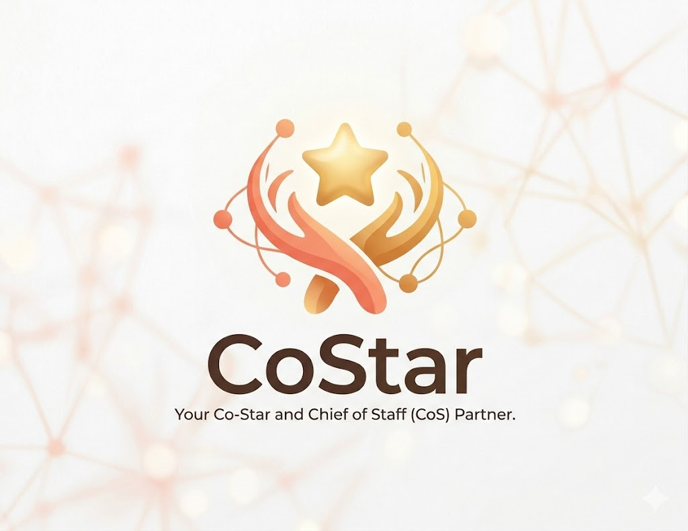

# CoStar

<p align="center">
  
</p>

<p align="center"><strong>I'll handle everything. You just go.</strong></p>

CoStar is a skill-first relationship operating system for building and using high-trust context.

It is designed to help a user:

- ingest messy personal or work materials
- identify and update key people
- review and commit profile changes safely
- keep long-lived relationship views fresh
- generate briefing, roleplay, and graph outputs on top of confirmed context

This repository contains the current CoStar skill core.

## What CoStar Does

CoStar turns raw material into durable relationship context through a staged skill pipeline:

1. `capture`
   - accepts single or batch inputs
   - recalls relevant existing context automatically
   - gives the user clear feedback on what was found and what needs review

2. `ingestion`
   - resolves people
   - extracts profile updates, intent, attitude, tags, and evidence
   - proposes `create / update / review / ignore`

3. `review -> commit`
   - lets a user confirm or defer uncertain updates
   - writes approved changes back to the profile store

4. `view`
   - refreshes persistent person views instead of producing one-off slices

5. downstream use
   - `briefing`
   - `roleplay`
   - `graph`

## Included Skills

The current skill set in this repository:

- `relationship-ingestion`
- `relationship-capture`
- `relationship-profile`
- `relationship-briefing`
- `relationship-roleplay`
- `relationship-graph`
- `relationship-view`

## Branch Strategy

This repository is intentionally split by branch.

### `main`

`main` is the clean distribution branch.

It keeps:

- core runtimes
- prompts
- schemas
- example inputs and outputs
- minimal repo metadata

It does **not** keep:

- process-heavy build notes
- validation workspaces
- generated run artifacts
- real-data scenario outputs

### `build-history`

`build-history` keeps development context and validation materials, such as:

- build plans
- acceptance checklists
- Claude test manual
- smoke and acceptance scripts
- support utilities used during development

## Repository Layout

```text
skill-system/
  assets/branding/            Brand assets for GitHub and docs
  relationship-ingestion/     Core extraction and review-resolution engine
  relationship-capture/       User-facing ingestion orchestration layer
  relationship-profile/       Durable profile read/update skill
  relationship-briefing/      Brief generation from confirmed context
  relationship-roleplay/      Structured simulated dialogue skill
  relationship-graph/         Relationship graph and pathfinding skill
  relationship-view/          Persistent markdown views and refresh logic
  real-use-logs/              Real usage logs and templates
  scripts/                    Repo support scripts
```

## Quick Start

If you are a test user, start here:

- [START_HERE.md](START_HERE.md)

### 1. Prepare model config

Use the template at:

- `relationship-ingestion/runtime/model-config.template.json`

Create your local model config as:

- `relationship-ingestion/runtime/model-config.local.json`

This local credential file is ignored by git.

### 2. Run a skill directly

Examples:

```powershell
node relationship-ingestion/runtime/run-relationship-ingestion.mjs ^
  relationship-ingestion/samples/relationship-ingestion.request.example.json
```

```powershell
node relationship-capture/runtime/run-relationship-capture.mjs ^
  relationship-capture/samples/relationship-capture.request.ingest.example.json
```

```powershell
node relationship-briefing/runtime/run-relationship-briefing.mjs ^
  relationship-briefing/samples/relationship-briefing.request.example.json
```

### 3. Use the validation branch when needed

If you want the full build context, acceptance materials, and validation scripts, switch to:

- `build-history`

## Versioning Rules

This repo intentionally excludes local and generated artifacts such as:

- local model credentials
- runtime stores
- runtime runs
- validation run workspaces
- generated briefings
- generated person views
- real scenario outputs from private data

That keeps `main` reusable and safe to share.

## Status

CoStar has already validated the core closed loop locally:

`capture -> ingestion -> review -> commit -> view -> briefing / roleplay / graph`

The current focus is improving quality under real usage while keeping the skill layer clean and inspectable.
