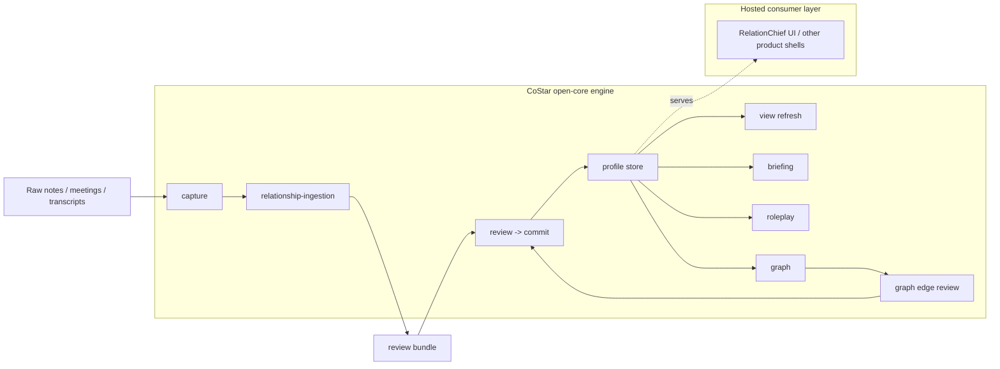

# CoStar Architecture

## Reading the diagram

- `capture` handles intake and feedback.
- `relationship-ingestion` resolves people and proposes updates.
- `review -> commit` writes back only what is confirmed.
- `profile store` is the long-lived memory layer.
- `view`, `briefing`, `roleplay`, and `graph` consume the confirmed store.
- A separate product shell can sit on top of the engine for non-technical users.
